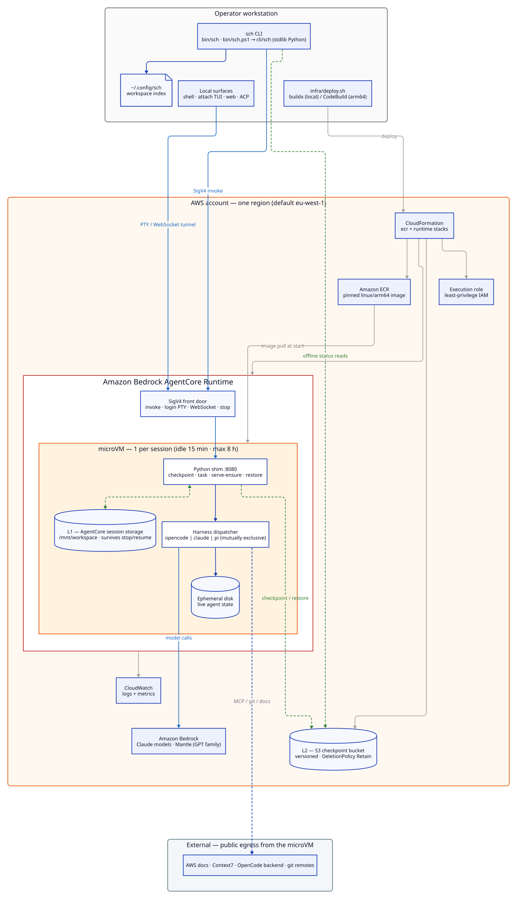

# SCH Architecture

One diagram, top to bottom: what runs on the operator's machine, what runs
in the AWS account, and where state lives. Details are deliberately omitted
here — the normative specs under [`docs/specs/`](../specs/) are the source
of truth for every behavior shown below.

## Big picture



Edge colors: **blue** = live session traffic, **green dashed** = durability
(checkpoint/restore), **grey** = one-time provisioning.

The diagram is generated from [`architecture.d2`](architecture.d2).
Regenerate after editing:

```sh
d2 --layout elk --pad 24 docs/architecture/architecture.d2 docs/architecture/architecture.svg
```

## The three planes

| Plane | Where | What it does |
| --- | --- | --- |
| Operator | laptop | Deploys (`infra/deploy.sh`), then drives everything through the `sch` CLI: interactive shells, headless tasks, attach/web/ACP surfaces, dashboard. The local workspace index maps workspace names to session ids. |
| Runtime | AgentCore microVM | One microVM per session. A Python shim handles checkpoints, headless tasks, and readiness; a dispatcher starts exactly one harness (opencode, claude, or pi) per workspace. Model calls go to Amazon Bedrock. |
| Durability | AWS storage | Two layers: **L1** (AgentCore session storage on `/mnt/workspace`) survives stop/resume but resets on a runtime-version bump and expires after 14 idle days; **L2** (versioned S3 checkpoint bucket) survives everything, including runtime deletion. |

## Session lifecycle in one line

`sch shell` → SigV4 invoke → microVM starts (image pull, L2 restore, harness
boots) → work happens → on stop/idle the shim checkpoints L1 to L2 → next
`sch` command restores from L1 (restore-always-wins).

Further reading: [runtime provisioning](../specs/platform/runtime-provisioning.md)
· [runtime image](../specs/platform/runtime-image.md) ·
[persistence](../specs/workspace-lifecycle/workspace-persistence.md) ·
[checkpointing](../specs/workspace-lifecycle/workspace-checkpointing.md) ·
[access surfaces](../specs/access-surfaces/cli-cross-platform.md).
